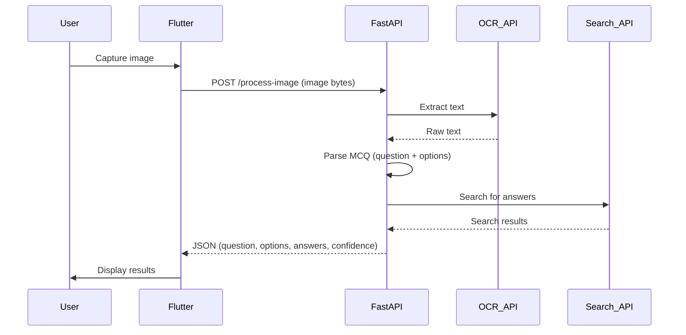

# 📱 MCQ Scanner: Flutter + FastAPI

<div align="center">

[](https://www.python.org/)
[](https://fastapi.tiangolo.com/)
[](https://flutter.dev/)
[](https://dart.dev/)
[](https://opensource.org/licenses/MIT)

A modern mobile application that scans MCQ questions from an image, extracts text using OCR, and returns possible answers using a FastAPI backend.

</div>


---


## ✨ Features


- 📸 **Real-time camera capture** – built with Flutter and `camera` plugin.

- 🔍 **OCR extraction** – uses OCR.space API to extract text from images.

- 🤖 **Answer retrieval** – scrapes search results to find matching answers.

- 🚀 **FastAPI backend** – efficient, scalable, and easily deployable.

- 📱 **Cross‑platform** – runs on Android (iOS ready with minimal changes).

- 🎨 **Clean Material Design UI** – responsive and user‑friendly.


---


## 🏗️ Architecture




---


## 📁 Project Structure


```bash

mcq_scanner_flutter_fastapi
├── .git
│   ├── HEAD
│   ├── config
│   ├── description
│   ├── hooks
│   │   ├── applypatch-msg.sample
│   │   ├── commit-msg.sample
│   │   ├── fsmonitor-watchman.sample
│   │   ├── post-update.sample
│   │   ├── pre-applypatch.sample
│   │   ├── pre-commit.sample
│   │   ├── pre-merge-commit.sample
│   │   ├── pre-push.sample
│   │   ├── pre-rebase.sample
│   │   ├── pre-receive.sample
│   │   ├── prepare-commit-msg.sample
│   │   ├── push-to-checkout.sample
│   │   ├── sendemail-validate.sample
│   │   └── update.sample
│   ├── index
│   ├── info
│   │   └── exclude
│   ├── objects
│   └── refs
│       ├── heads
│       └── tags
├── .gitignore
├── .idea
│   ├── .gitignore
│   ├── caches
│   │   └── deviceStreaming.xml
│   ├── deviceManager.xml
│   ├── mcq_scanner_flutter_fastapi.iml
│   ├── modules.xml
│   └── workspace.xml
├── README.md
├── backend_fastapi
│   ├── .env
│   ├── .gitignore
│   ├── Dockerfile
│   ├── app
│   │   ├── __init__.py
│   │   ├── __pycache__
│   │   ├── core
│   │   ├── main.py
│   │   ├── models
│   │   ├── routes
│   │   └── services
│   ├── requirements.txt
│   └── venv
│       ├── Include
│       ├── Lib
│       ├── Scripts
│       └── pyvenv.cfg
└── frontend_flutter
        ├── .dart_tool
		│   ├── dartpad
		│   ├── flutter_build
		│   ├── hooks_runner
		│   ├── package_config.json
		│   ├── package_graph.json
		│   └── version
		├── .env
		├── .flutter-plugins-dependencies
		├── .gitignore
		├── .idea
		│   ├── libraries
		│   ├── modules.xml
		│   ├── runConfigurations
		│   └── workspace.xml
		├── .metadata
		├── README.md
		├── analysis_options.yaml
		├── android
		│   ├── .gitignore
		│   ├── .gradle
		│   ├── .kotlin
		│   ├── app
		│   ├── build.gradle.kts
		│   ├── frontend_flutter_android.iml
		│   ├── gradle
		│   ├── gradle.properties
		│   ├── gradlew
		│   ├── gradlew.bat
		│   ├── local.properties
		│   └── settings.gradle.kts
		├── assets
		│   ├── icon
		│   └── splash
		├── build
		│   ├── .cxx
		│   ├── app
		│   ├── b2f7e7edd35b3c8d4f463bb8b035ecd8.cache.dill.track.dill
		│   ├── camera_android_camerax
		│   ├── flutter_assets
		│   ├── flutter_native_splash
		│   ├── flutter_plugin_android_lifecycle
		│   ├── image_picker_android
		│   ├── native_assets
		│   ├── native_hooks
		│   ├── path_provider_android
		│   ├── permission_handler_android
		│   └── reports
		├── frontend_flutter.iml
		├── ios
		│   ├── .gitignore
		│   ├── Flutter
		│   ├── Runner
		│   ├── Runner.xcodeproj
		│   ├── Runner.xcworkspace
		│   └── RunnerTests
		├── lib
		│   ├── main.dart
		│   ├── models
		│   ├── screens
		│   ├── services
		│   └── utils
		├── linux
		│   ├── .gitignore
		│   ├── CMakeLists.txt
		│   ├── flutter
		│   └── runner
		├── macos
		│   ├── .gitignore
		│   ├── Flutter
		│   ├── Runner
		│   ├── Runner.xcodeproj
		│   ├── Runner.xcworkspace
		│   └── RunnerTests
		├── pubspec.lock
		├── pubspec.yaml
		├── test
		│   └── widget_test.dart
		├── web
		│   ├── favicon.png
		│   ├── icons
		│   ├── index.html
		│   ├── manifest.json
		│   └── splash
		└── windows
		   ├── .gitignore
		   ├── CMakeLists.txt
		   ├── flutter
		   └── runner

```


*For a complete tree, see the repository.*


---


## 🛠️ Prerequisites


- **Flutter SDK** (latest stable) – [Installation guide](https://flutter.dev/docs/get-started/install)

- **Android Studio** (for Android emulator / build)

- **Python 3.10+**

- **Git**


---


## 🐍 Backend Setup (FastAPI)


### 1. Clone the repository

```bash

git clone https://github.com/Kennny7/mcq_scanner_flutter_fastapi.git

cd mcq_scanner_flutter_fastapi\backend_fastapi

```


### 2. Create and activate a virtual environment

```bash

# Windows

python -m venv venv

venv\Scripts\activate


# macOS / Linux

python3 -m venv venv

source venv/bin/activate

```


### 3. Install dependencies

```bash

pip install -r requirements.txt

```


### 4. Set up environment variables

Create a `.env` file in `backend_fastapi/` (copy from `.env.example` if present):

```env

OCR_SPACE_API_KEY=your_ocr_space_key_here
GEMINI_API_KEY=your_gemini_api_key_here
OCR_CONFIDENCE_THRESHOLD=0.5
MAX_SEARCH_RESULTS=3
SEARCH_TIMEOUT=15
GEMINI_MODEL=gemini-2.5-flash-lite
LOG_LEVEL=INFO

```

> 💡 Get a free OCR.space API key from \[ocr.space/ocrapi](https://ocr.space/ocrapi).


### 5. Run the server

```bash

uvicorn app.main:app --reload --host 0.0.0.0 --port 8000

```

You should see:

```

INFO:     Uvicorn running on http://0.0.0.0:8000

```


### 6. Test the API

Open your browser at [http://localhost:8000/docs](http://localhost:8000/docs). The interactive Swagger UI will appear, allowing you to test the `/process-image` endpoint.


---


## 📱 Frontend Setup (Flutter)


### 1. Navigate to frontend directory

```bash

cd ../frontend_flutter

```


### 2. Get dependencies

```bash

flutter pub get

```


### 3. Configure backend URL

Create a `.env` file in `frontend_flutter/` (or edit `lib/services/api_service.dart` directly for development):

```env

API_BASE_URL=http://10.0.2.2:8000   # Android emulator

# API_BASE_URL=http://192.168.x.x:8000   # Physical device (use your local IP)

```

> **Important**:  

> - For Android emulator, use `10.0.2.2` to refer to the host machine.  

> - For a physical device, use your computer's IPv4 address (e.g., `192.168.1.10`).  

> - Make sure port 8000 is open in your firewall.


### 4. Run the app on an emulator or device

```bash

# List available devices

flutter devices


# Run on a specific device

flutter run -d <device_id>

```

The app will start and ask for camera permissions.


---


## 🔧 Building for Android


### 1. Ensure `android/app/src/main/AndroidManifest.xml` contains camera permission

```xml

<uses-permission android:name="android.permission.CAMERA" />

<uses-feature android:name="android.hardware.camera" android:required="true" />

```


### 2. Add app icon and splash screen

We use the `flutter_native_splash` package. After adding it to `pubspec.yaml`, run:

```bash

flutter pub run flutter_native_splash:create

```

This will generate the splash screen images and update the Android manifest.


### 3. Build APK

```bash

flutter build apk --release

```

The APK will be located at `build/app/outputs/flutter-apk/app-release.apk`.


### 4. Test on physical device

- Enable **Developer options** and **USB debugging** on your Android device.

- Connect via USB and run `flutter run` or transfer the APK and install it.


---


## 🔐 Environment Variables (Detailed)


### Backend `.env`

| Variable | Description |

|----------|-------------|

| `OCR_SPACE_API_KEY` | Your OCR.space API key (required). |

| `OCR_CONFIDENCE_THRESHOLD` | Minimum confidence score (0–1) to accept OCR text. |

| `MAX_SEARCH_RESULTS` | Number of search results to analyze. |

| `SEARCH_TIMEOUT` | Timeout for web requests in seconds. |

| `LOG_LEVEL` | Logging level (`INFO`, `DEBUG`, etc.). |


### Frontend `.env`

| Variable | Description |

|----------|-------------|

| `API_BASE_URL` | Full URL of the FastAPI backend (e.g., `http://10.0.2.2:8000`). |


> The frontend reads this via `flutter_dotenv`. Make sure to include `.env` in `.gitignore` to avoid exposing secrets.


---


## 🔌 API Endpoints


| Method | Endpoint | Description |

|--------|----------|-------------|

| `GET`  | `/` | Root endpoint – returns `{"message": "MCQ Scanner API is running"}` |

| `POST` | `/api/process-image` | Accepts an image file (`multipart/form-data`) and returns extracted MCQ data and answers. |


**Request example (curl):**

```bash

curl -X POST http://localhost:8000/api/process-image -F "file=@/path/to/your/image.jpg"

```


**Response example:**

```json

{
  "success": true,
  "question": "What is the capital of France?",
  "options": {
    "A": "Berlin",
    "B": "Madrid",
    "C": "Paris",
    "D": "Lisbon"
  },
  "answers": ["C"],
  "confidence": 0.92,
  "message": "Processing complete"
}

```


---


## 🧪 Testing in Android Studio


1\. Open the `frontend_flutter` folder in Android Studio as a Flutter project.

2\. Use the **Device Manager** to create an Android emulator (API 34+).

3\. Click the **Run** button or press `Shift + F10`.

4\. The app will build and launch on the emulator.


---


## 📦 Deployment Considerations


- **Backend**: You can deploy the FastAPI app to a cloud server (e.g., AWS EC2, DigitalOcean, or Render) using the provided `Dockerfile`.  

- **Frontend**: After building the APK, you can distribute it via Google Play Store or direct download.


---


## 📜 License


This project is licensed under the **MIT License**. See the \[LICENSE](LICENSE) file for details.


---


## 🙏 Acknowledgments


- \[OCR.space](https://ocr.space/) for their free OCR API.

- \[FastAPI](https://fastapi.tiangolo.com/) for the awesome web framework.

- \[Flutter](https://flutter.dev/) for enabling cross-platform development.

- \[Kivy](https://kivy.org/) – the original framework that inspired this rewrite.


---


## 🔗 Useful Links

<div align="center">

[](https://www.python.org/)
[](https://fastapi.tiangolo.com/)
[](https://flutter.dev/)
[](https://dart.dev/)
[](https://ocr.space/)
[](https://github.com/Kennny7/mcq_scanner_flutter_fastapi)

</div>


---


> Made with ❤️ by \[Kennny7](https://github.com/Kennny7)

